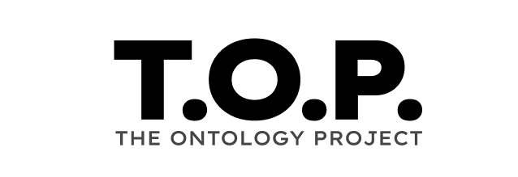

<p align="center">
  <picture>
    <source media="(prefers-color-scheme: dark)" srcset="images/top-logo-inverse.svg">
    
  </picture>
</p>

# The Ontology Project

> An open ontology for high-consequence regulated industries, governed by domain working groups, hosted under Apache 2.0.

The Ontology Project (TOP) is industry-agnostic infrastructure for building reference ontologies that downstream consumers actually use. The foundation is **TOP Core** — one root, eight categories, twenty-eight leaves — authored as SKOS for taxonomy tooling, mirrored as OWL/SHACL for reasoners and validators, aligned to PROV-O at the class level and to BFO on the four edges where it is clean. Workflow extensions (clinical research, care delivery, manufacturing, supply chain, …) compose on top of Core; they never sibling.

Practitioner-first by design. AI agents and ontologist tooling are honored at the edge — via the PROV-O / BFO alignment — but they never shape Core. The manifesto's "we owe it to humans" stance is structural, not aspirational.

If you are reading this in 2026 you are early. TOP Core landed at v1; workflow extensions are queuing up.

## What you will find here

- [`taxonomy/taxonomy.ttl`](taxonomy/taxonomy.ttl) — the SKOS view: 1 top concept (`top:Core`) + 8 categories + 28 leaves. TermBoard-importable. Pure SKOS; loads cleanly into PoolParty, Synaptica, Protégé.
- [`taxonomy/taxonomy.csv`](taxonomy/taxonomy.csv) — flat companion for spreadsheet review of the SKOS.
- [`core/v1/shapes.ttl`](core/v1/shapes.ttl) — the OWL/SHACL view: same URIs as the SKOS, expressed as `owl:Class` with `rdfs:subClassOf` chains, the three Universal DNA properties, the category relational extensions, and the SHACL `top:UniversalDNAShape` that enforces `identifier` + `observedAt` + `status` on every TOP entity.
- [`core/v1/index.html`](core/v1/index.html) — the spec page (web view) for sharing with reviewers and conveners.
- [`core/v1/walkthroughs/person.ttl`](core/v1/walkthroughs/person.ttl) — a single concrete instance demonstrating the L0 → L1 → L2 pattern end-to-end. Useful for verifying the structure resolves in any tool.
- [`taxonomy.md`](taxonomy.md) — prose narrative of the taxonomy: three layers, eight categories, twenty-eight leaves, authoring rules.
- [`first-principles.md`](first-principles.md) — design rules every spec doc, planning note, and PR can cite by name.
- [`governance/`](governance/) — working group structure, RFC process, release process, and the [architectural decision log](governance/decision-log.md). Where new contributors learn the rules.
- [`manifesto.html`](manifesto.html) — manifesto with founding signatories.
- [`roadmap.md`](roadmap.md) — what ships next, what is queued behind it, how community contributions enter the project.

Workflow extensions will live in their own directories at the repository root. The first one — `clinical-research/` — is forming around the 12 operational functional areas (Study Design, Regulatory Affairs, Finance, Setup, Site Management, Clinical Supply, Recruitment, Intervention, Pharmacovigilance, Data Management, Monitoring, Quality Management). Pre-Core clinical-research work is archived under [`legacy/`](legacy/) — operator-vocabulary insights remain useful as reference; the artifact shapes conflict with Core and should not be loaded against it.

## Quickstart

Load the SKOS taxonomy into any SKOS-aware tool ([TermBoard](https://termboard.com), PoolParty, Synaptica, Protégé). The full tree — `top:Core` → 8 categories → 28 leaves — appears with PROV-O alignment via `skos:exactMatch` / `skos:closeMatch`.

```bash
# Direct fetch (no auth)
curl -L https://raw.githubusercontent.com/scientixai/the-ontology-project/main/taxonomy/taxonomy.ttl -o taxonomy.ttl
```

Validate a concrete entity against the Universal DNA SHACL contract (requires `pyshacl` and `rdflib`).

```bash
python3 -m pyshacl --advanced \
  -s core/v1/shapes.ttl \
  -d core/v1/walkthroughs/person.ttl
```

The `--advanced` flag enables SHACL-SPARQL processing. The walkthrough conforms cleanly; modifying it (removing `top:identifier`, `top:observedAt`, or `top:status`) surfaces a violation against the `top:UniversalDNAShape`.

## What problem this solves

Frontier AI is being deployed against high-consequence regulated data faster than the data itself can be made trustworthy. Models hallucinate. Provenance gets lost. Outputs get hand-waved as "good enough" by people who do not have to live with the consequences. The clinical lifecycle is one of the highest-stakes domains in this collision: a hallucinated dose, a misattributed adverse event, a missing audit trail can kill someone. The same dynamics show up in pharmaceutical manufacturing, supply chain, energy, defense.

TOP is the foundation for verifiable, source-grounded AI in regulated environments. The taxonomy defines what entities exist and how they relate. The SHACL contract encodes the structural invariants every entity must carry. PROV-O alignment at the class level means audit-trail tooling that consumes PROV gets a free seat at the table. BFO alignment on the four clean categories means OBO Foundry interop is available where it lands cleanly. Downstream tools (LLMs grounded in the graph, decision-support systems, regulatory analytics) project from the same source of truth and stay traceable.

The same Core works outside healthcare and life sciences. Energy and process industries (analogues to ISO 15926 and CFIHOS), manufacturing, defense supply chains, anywhere AI is being deployed against high-consequence data and provenance cannot be optional.

## How to contribute

See [CONTRIBUTING.md](CONTRIBUTING.md) for the working-group model, the RFC process, and per-domain ownership.

In short: every domain has a working group. The working group owns its workflow extension's source files. Amendments to Core are governed jointly across working groups because changes affect every domain. RFCs land as markdown documents in `governance/rfcs/`, get reviewed by the relevant working group, and merge through PR with at least one approving review from a working-group member.

For now, while working groups are forming, Bo Lora as convener is the review pool of one. As working groups spin up, governance rotates to those groups, and founding signatories on the manifesto step into advisory roles.

## License

Apache License 2.0. See [LICENSE](LICENSE).

## Contact

The Ontology Project is convened by Bo Lora at Scientix.ai Inc.

- Project: [top.scientix.ai](https://top.scientix.ai)
- Manifesto: [manifesto.html](manifesto.html)
- Roadmap: [roadmap.md](roadmap.md)
- Convener: [bolora.me](https://bolora.me)

---

<p align="center">
  <a href="https://scientix.ai">
    <picture>
      <source media="(prefers-color-scheme: dark)" srcset="images/sponsored-by-scientixai-inverse.svg">
      
    </picture>
  </a>
</p>
